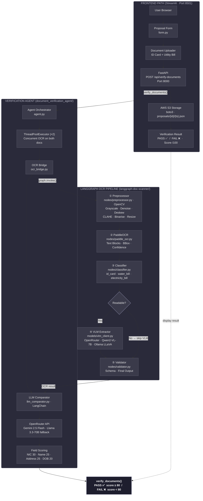

# 🛡️ Janashakthi Document Verification System

An AI-powered, multi-agent document verification pipeline built for insurance proposal processing.  
It uses a **LangGraph** OCR pipeline, **Vision-Language Models (VLMs)**, and an **LLM comparator** to automatically verify uploaded ID cards and utility bills against proposal form data — returning a structured pass/fail score.

---

## 📐 Architecture



---

## 🗂️ Project Structure

```
multiagent_system/
├── backend/                          # FastAPI REST API
│   ├── main.py                       # API routes: /verify-documents, /proposals
│   └── s3_storage.py                 # AWS S3 versioned proposal storage
│
├── document_verification_agent/      # Verification orchestrator
│   ├── agent.py                      # Concurrent OCR + LLM comparison
│   ├── ocr_bridge.py                 # Calls LangGraph pipeline
│   └── llm_comparator.py            # LLM-powered field comparison (LangChain)
│
├── langgraph-doc-scanner/            # LangGraph OCR graph
│   ├── graph.py                      # Graph definition & conditional routing
│   ├── state.py                      # Shared AgentState TypedDict
│   ├── nodes/
│   │   ├── preprocessor.py          # Image preprocessing (OpenCV)
│   │   ├── paddle_ocr.py            # OCR via PaddleOCR
│   │   ├── classifier.py            # Document type classification
│   │   ├── vlm_extractor.py         # Field extraction via VLM
│   │   └── validator.py             # Output validation & schema
│   ├── models/
│   │   └── vlm_client.py            # VLM backend abstraction (OpenRouter/Qwen/Ollama)
│   └── utils/
│       ├── image_utils.py
│       └── schema.py
│
├── frontend/                         # Streamlit web app
│   └── form.py                       # Insurance proposal form (6 tabs)
│
├── architecture.drawio               # System architecture diagram
├── docker-compose.yml                # Docker orchestration
├── backend.Dockerfile                # Backend container
├── frontend.Dockerfile               # Frontend container
├── requirements.txt                  # All Python dependencies
└── .env                              # Environment variables
```

---

## 🧪 Verification Pipeline Flow

```
User uploads: ID Card + Utility Bill + fills Proposal Form
        │
        ▼
[FastAPI] receives multipart upload
        │
        ▼ (ThreadPoolExecutor — concurrent)
[OCR Bridge] runs LangGraph on BOTH documents simultaneously
        │
        ├─ Document 1 (ID Card) ─────────────────────────────┐
        │                                                       │
        └─ Document 2 (Utility Bill) ────────────────────────┤
                                                               │
        Each document passes through:                         │
        ① Preprocessor  → grayscale, denoise, deskew, CLAHE  │
        ② PaddleOCR     → text blocks + bounding boxes        │
        ③ Classifier    → id_card / water_bill / elec_bill    │
        ④ VLM Extractor → structured field extraction         │
        ⑤ Validator     → schema validation + final output    │
                                                               ▼
[LLM Comparator] compares OCR results vs Proposal form data
        │
        ├── NIC / ID Number  → 30 pts (loose matching)
        ├── Full Name        → 25 pts (loose matching)
        ├── Address          → 25 pts (strict matching)
        └── Date of Birth    → 20 pts (strict matching)
                                         │
                                         ▼
                              Score ≥ 80 → PASS ✅
                              Score < 80 → FAIL ❌
```

---

## 🛠️ Technologies Used

### 🧠 AI / Machine Learning

| Technology | Version | Purpose |
|---|---|---|
| **LangGraph** | ≥ 0.2.0 | Multi-node stateful agent graph |
| **LangChain Core** | ≥ 0.2.0 | LLM abstraction & message types |
| **LangChain OpenAI** | ≥ 0.1.0 | OpenRouter-compatible LLM client |
| **PaddleOCR** | ≥ 2.8.0 | Optical Character Recognition |
| **PaddlePaddle** | ≥ 3.0.0 | PaddleOCR backend (CPU/GPU) |
| **Qwen2-VL-7B-Instruct** | HuggingFace | Local Vision-Language Model |
| **transformers** | ≥ 4.45.0 | HuggingFace model loading |
| **accelerate** | ≥ 0.33.0 | GPU/CPU model placement |
| **torch (PyTorch)** | ≥ 2.2.0 | Deep learning inference backend |
| **qwen-vl-utils** | ≥ 0.0.8 | Qwen2-VL input processing |

### 🌐 LLM / VLM APIs (Cloud)

| Service | Models Used | Purpose |
|---|---|---|
| **OpenRouter** | `google/gemini-2.5-flash` | Primary VLM + LLM |
| **OpenRouter** | `meta-llama/llama-3.3-70b-instruct:free` | Fallback LLM |
| **Ollama** (optional) | `llava` | Local LLaVA vision model |

### 🖼️ Image Processing

| Technology | Version | Purpose |
|---|---|---|
| **OpenCV** (`opencv-python`) | ≥ 4.9.0 | Preprocessing, deskew, denoise, CLAHE |
| **NumPy** | ≥ 1.26.0 | Array operations on images |
| **Pillow** | ≥ 10.0.0 | Image loading & conversion |

### 🌐 Backend / API

| Technology | Version | Purpose |
|---|---|---|
| **FastAPI** | ≥ 0.104.1 | REST API framework |
| **Uvicorn** | ≥ 0.24.0 | ASGI server |
| **Pydantic** | ≥ 2.0.0 | Request/response data validation |
| **python-multipart** | ≥ 0.0.6 | Multipart file upload handling |

### ☁️ Cloud & Storage

| Technology | Version | Purpose |
|---|---|---|
| **boto3** | ≥ 1.34.0 | AWS SDK for Python |
| **AWS S3** | — | Versioned proposal JSON storage |

### 🖥️ Frontend

| Technology | Version | Purpose |
|---|---|---|
| **Streamlit** | ≥ 1.32.0 | Insurance proposal form UI |
| **pandas** | ≥ 2.0.0 | Data editing (tables, nominees) |

### 🐳 DevOps / Infrastructure

| Technology | Purpose |
|---|---|
| **Docker** | Containerisation |
| **Docker Compose** | Multi-service orchestration (backend + frontend) |

### 🐍 Python Utilities

| Technology | Version | Purpose |
|---|---|---|
| **python-dotenv** | ≥ 1.0.0 | Environment variable loading |
| **requests** | ≥ 2.31.0 | HTTP client (OpenRouter/Ollama API calls) |

---

## ⚙️ Environment Variables

Create a `.env` file in the project root:

```env
# OpenRouter (required for VLM + LLM)
OPENROUTER_API_KEY=your_openrouter_api_key_here
OPENROUTER_MODEL=google/gemini-2.5-flash   # optional, this is the default

# VLM Backend (openrouter | qwen2vl | ollama)
VLM_BACKEND=openrouter

# Ollama (only if VLM_BACKEND=ollama)
OLLAMA_URL=http://localhost:11434
OLLAMA_MODEL=llava

# AWS S3
AWS_ACCESS_KEY_ID=your_aws_access_key
AWS_SECRET_ACCESS_KEY=your_aws_secret_key
AWS_REGION=ap-southeast-1
S3_BUCKET_NAME=your_s3_bucket_name
```

---

## 🚀 Getting Started

### Option 1: Docker Compose (recommended)

```bash
# Build and start both services
docker-compose up --build

# Frontend: http://localhost:8501
# Backend:  http://localhost:8000
# API docs: http://localhost:8000/docs
```

### Option 2: Local Development

```bash
# Install dependencies
pip install -r requirements.txt

# Start FastAPI backend
uvicorn backend.main:app --host 0.0.0.0 --port 8000 --reload

# Start Streamlit frontend (in a separate terminal)
streamlit run frontend/form.py
```

---

## 📡 API Reference

| Method | Endpoint | Description |
|--------|----------|-------------|
| `GET` | `/health` | Health check + S3 status |
| `POST` | `/api/verify-documents` | Run OCR + LLM verification |
| `POST` | `/api/proposals/{id}` | Save proposal to AWS S3 |
| `GET` | `/api/proposals/{id}` | Fetch latest proposal from S3 |

### `/api/verify-documents` — Request

```
Content-Type: multipart/form-data
  id_card_image:       <file>   (jpg/png/pdf/tiff/bmp/webp)
  utility_bill_image:  <file>   (jpg/png/pdf/tiff/bmp/webp)
  proposal_data:       <string> (JSON)
```

### `/api/verify-documents` — Response

```json
{
  "overall_status": "PASS",
  "overall_score": 85,
  "summary": "NIC and name matched. Address partially matched.",
  "checks": [
    {
      "field": "NIC Number",
      "proposal_value": "200012345678",
      "document_value": "2000-1234-5678",
      "source": "ID Card",
      "match": true,
      "score": 30,
      "max_score": 30,
      "reasoning": "Digits match after normalisation."
    }
  ],
  "id_card_ocr": { ... },
  "utility_bill_ocr": { ... }
}
```

---

## 🏗️ LangGraph Node Details

| Node | File | Description |
|------|------|-------------|
| **preprocessor** | `nodes/preprocessor.py` | Grayscale → Denoise (NLMeans) → 90° rotation detection → Deskew (Hough) → CLAHE → Binarise (Otsu/Adaptive) → Resize |
| **paddle_ocr** | `nodes/paddle_ocr.py` | PaddleOCR inference → text blocks + bounding boxes + confidence |
| **classifier** | `nodes/classifier.py` | Keyword heuristic scoring → `id_card` / `water_bill` / `electricity_bill` / `unknown` |
| **vlm_extractor** | `nodes/vlm_extractor.py` | VLM prompt → structured JSON field extraction |
| **validator** | `nodes/validator.py` | Schema validation → `final_output` + `validation_errors` |

### Conditional Routing (after classifier)

```
doc_type = "unknown" AND ocr_text too short?
    └─ YES → Skip VLM → validator → END
    └─ NO  → vlm_extractor → validator → END
```

---

## 🔒 Verification Scoring

| Field | Points | Matching Strategy |
|-------|--------|-------------------|
| NIC / ID Number | 30 | Loose — ignore spaces, dashes, case |
| Full Name | 25 | Loose — ignore order, initials vs full |
| Address | 25 | Strict — location must match semantically |
| Date of Birth | 20 | Strict — format-agnostic date comparison |
| **Total** | **100** | **Pass ≥ 80 · Fail < 80** |

---

## 📄 License

This project is developed for **Janashakthi Life Insurance** internal use.

---

*Built with ❤️ using LangGraph · PaddleOCR · OpenRouter · FastAPI · Streamlit · AWS S3*
